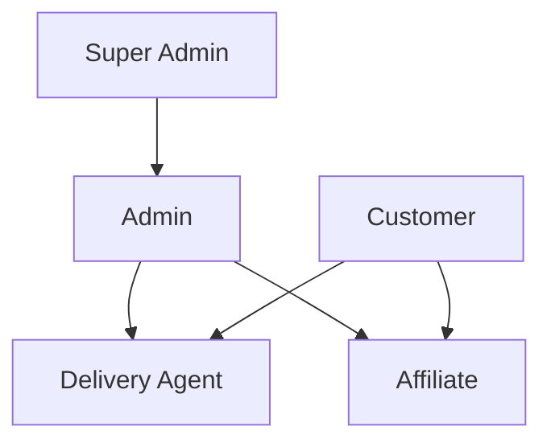
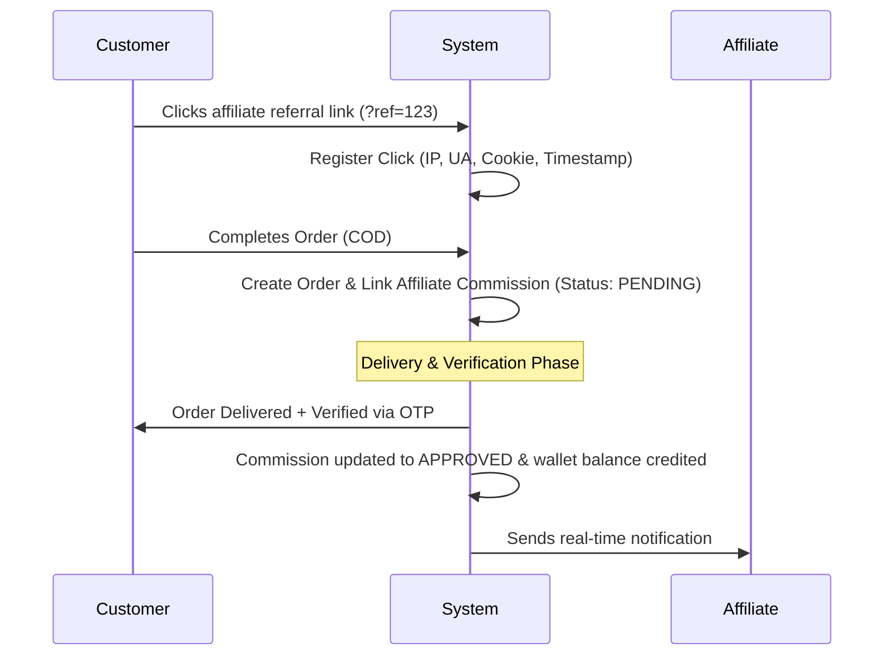

# Product Requirements Document (PRD)

## Project Name: Mangosteen

### Document Version: 1.0.0 (Production-Ready Draft)

### System Classification: Enterprise B2C E-Commerce & Affiliate Network

---

## 1. Document Control & Agent Collaboration Log

To achieve an enterprise-grade standard, this document was developed under a **Two-Agent Peer Review Workflow**:

| Role               | Agent Persona                                  | Contribution                                                                                                                                   |
| :----------------- | :--------------------------------------------- | :--------------------------------------------------------------------------------------------------------------------------------------------- |
| **Drafting Agent** | **Agent 1: Lead Enterprise Architect**         | Authored product roadmap, core functional specs, user personas, dashboard metrics, SEO parameters, and system requirements.                    |
| **Reviewer Agent** | **Agent 2: Principal DevSecOps & QA Engineer** | Conducted security audits, defined rate limits, anti-fraud algorithms for affiliate tracking, secure COD workflows, and compliance guardrails. |

### Peer Review & Hardening Log:

- **Audit Ref #1 (Affiliate Fraud)**: Added strict requirements for device/IP fingerprinting, click-to-conversion minimum delays (15 seconds), and commission holding periods (post-COD verification).
- **Audit Ref #2 (Secure COD Verification)**: Added a mandatory high-entropy 6-digit OTP verification process to prevent delivery agent fraud and ensure customer presence.
- **Audit Ref #3 (Multi-Channel Notification Throttling)**: Implemented strict rate limits on SMS and Email OTP endpoints using Redis-based sliding-window algorithms to prevent SMS bombing costs.

---

## 2. Executive Summary & Project Goal

**Mangosteen** is a premium, high-scale, full-stack e-commerce monorepo ecosystem specialized in selling fresh, seasonal, organic, and non-organic mangoes online. The platform bridges the gap between premium mango growers (e.g., in Rajshahi, Chapainawabganj, Sathkhira) and direct consumers, powered by an integrated **Affiliate Selling Network**.

### Key Value Propositions:

1. **Freshness & Quality Tracking**: Provides transparency regarding harvest dates, origin district, box count, and sweetness levels.
2. **Performance Marketing Integration**: Affiliates promote mangoes through deep-linked referrals, earning trackable, automated, and secure commissions.
3. **Robust Operational Control**: Offers specialized panels for Admins, Super Admins, and Delivery Agents, securing cash collection and optimizing logistics.
4. **Resilient Cash on Delivery (COD)**: Supports highly robust, OTP-verified COD workflows alongside automated credit card transactions via Stripe and SSLCommerz.

---

## 3. User Roles & Personas

The platform supports five core roles. Each role requires dedicated interfaces, rate-limit policies, and strict Role-Based Access Control (RBAC).

### 3.1. Customer

- **Objectives**: Browse mango collections, filter by district/sweetness/organic status, purchase premium boxes, track real-time deliveries, apply discount coupons, and review products.
- **Auth**: Email/Password, OTP-based fast login, Google/Facebook Social Login.

### 3.2. Affiliate

- **Objectives**: Promote specific seasonal mango campaigns and boxes, track referral traffic, view raw conversion metrics, manage balance, request payouts, and verify commission status.
- **Auth**: Email/Password, email/phone verification, bank/MFS payout detail registration.

### 3.3. Delivery Agent

- **Objectives**: Manage assigned orders for a specific delivery zone, update order status in real-time (Pending → Packed → Shipped → Delivered), and trigger secure OTP code confirmations for Cash on Delivery orders.
- **Interface**: Fully responsive, touch-friendly mobile-first UI with offline capabilities.

### 3.4. Admin

- **Objectives**: Manage mango inventory batches, configure pricing/discount policies, manage seasonal collections, approve/reject affiliate payout requests, analyze sales reports, and manage delivery agent zoning.
- **Interface**: Interactive Desktop-first Dashboard with extensive visual reporting and inventory alerts.

### 3.5. Super Admin

- **Objectives**: Overrule standard administrative locks, configure platform-wide system variables (default commission rates, API rate limits, notification gateways), manage system logs, and control Admin user provisioning.

---

## 4. Comprehensive System Modules

### 4.1. Authentication & User Management

- **Dual-Token System**: JWT (JSON Web Tokens) with a short lived access token (15 mins) and a secure, HttpOnly, SameSite=Strict refresh token (7 days) stored in the cookie layer.
- **Multi-Factor Auth**: SMS/Email OTP (One-Time Password) support for delivery agents and admins for high-risk operations (e.g., payouts, bulk status overrides).
- **Social Login**: Integrated OAuth2 support for Google and Facebook with automatic user profile creation.
- **Verification Flow**: Email activation link post-registration; payout accounts require active phone and identity verification.

### 4.2. Mango Product Management

- **Rich Cataloging**: Supports categorizing mangoes (Gopalbhog, Khirsapat, Himsagar, Langra, Amrapali) with specific metadata:
  - **Sweetness Scale**: Rated 1 to 5 stars.
  - **Organic Indicator**: Boolean flag indicating USDA/local organic certification.
  - **Origin District**: Origin tracking (e.g., Rajshahi, Chapainawabganj).
- **Product Variants**: Mango boxes sold by weight options (e.g., 5kg box, 10kg box, 20kg crate).
- **Inventory Control & Batch Management**:
  - Tracks individual harvest dates, batch codes, and estimated shelf-life days (default: 14 days).
  - Automatically issues system warnings to Admins when available stock falls below a variant's safe margin.
  - Support for real-time stock holds (reserved stock) during checkout (expires after 15 minutes of inactivity).

### 4.3. Affiliate Selling System & Referral Tracking

- **Attribution Rules**:
  - Cookie-based attribution utilizing a 30-day window.
  - Deep-link tracking: `/products/[slug]?ref=[affiliate_id]`.
- **Commission Engine**:
  - Dynamic commission allocation: Flat rate per box or percentage-based (e.g., 8% of cart total).
  - Multi-level commission tier support (e.g., Level 1 gets 8%, Level 2 gets 2% override).
- **Affiliate Dashboard**:
  - Real-time click count, pending orders, paid/unpaid earnings, and conversion rate chart.
  - Withdrawal interface with support for multiple payout channels (Bank Transfer, bKash, Rocket, SSLCommerz Payout).
- **Anti-Fraud Security Audit (Agent 2 Enforcement)**:
  - IP & User-Agent filtering: Prevents repeated self-referrals from the same device/network.
  - Click velocity checks: Clicks registered within 15 seconds of a previous click from the same IP are flagged.
  - COD Hold: Affiliate commissions are held in a `PENDING` state until the order has reached `DELIVERED` status and the COD payment status is marked `PAID` with verified OTP logs.

### 4.4. Shopping Experience

- **Elastic-Search Capability**: Client-side TanStack query-driven instant search, combined with server-side fuzzy string matching.
- **Faceted Navigation**: Filter products dynamically by Price Range, Sweetness Level, Weight, District, and Organic status.
- **Stateful Cart**: Syncs client-side Zustand store with server-side database cart entity for persistent multi-device shopping.
- **Coupon Manager**: Supports absolute value discounts (e.g., $10 off) and percentages (e.g., 15% off) with rules for expiration, usage counts, and minimum cart values.

### 4.5. Order Management & Verification

- **State Machine**: Strict transition validations enforced:
  `PENDING` $\rightarrow$ `CONFIRMED` $\rightarrow$ `PACKED` $\rightarrow$ `SHIPPED` $\rightarrow$ `DELIVERED` | `CANCELLED` | `FAILED`.
- **COD Hold State**: Orders placed via Cash on Delivery undergo an automatic automated phone or SMS verification phase before transition to `CONFIRMED`.
- **Invoice Generation**: Automated generation of secure PDF invoices, digitally signed, emailed to the customer upon delivery confirmation.

### 4.6. Delivery & Logistics Management

- **Zone Optimization**: System splits delivery operations into Area-based Delivery Zones.
- **Shipping Cost Engine**: Automatically calculates variable delivery fees based on the buyer's shipping district.
- **Delivery Agent Mobile Panel**: Offline-capable progress tracker listing assigned order routes.
- **Delivery OTP Verification**: Secure confirmation trigger where the customer receives an OTP via SMS, which must be entered by the delivery agent to mark an order as `DELIVERED`.

### 4.7. Payment System

- **Stripe Integration**: Secure tokenized checkout handling card payments, pre-authorizing charges, and handling Stripe Webhook processing for transaction completion.
- **SSLCommerz Integration**: Fully optimized integration with local payment methods (MFS: bKash, Nagad, Rocket; Cards: Visa, Mastercard) via redirection flows.
- **Payment Reconciliation**: Nightly cron job to verify that the transactions stored in the database match actual webhook callbacks and Stripe API responses.

### 4.8. Admin & Reporting Dashboard

- **Dynamic Analytics**:
  - Real-time sales velocity graphs, revenue, conversion rates, and profit margin analysis.
  - Inventory health tracking (Batch expirations, low stock notifications).
- **Affiliate Performance**: Ranking of highest-earning affiliates, payout processing queues, and click-to-conversion analytics.
- **Seasonal Campaigns & Banners**: Interface to schedule landing page updates, campaign start/end times, and priority items for flash sales.

### 4.9. Notification System (Queue-Based)

- **Under the Hood**: Redis-powered **BullMQ** processing queue ensures microservices-ready decoupled processing.
- **Channels**:
  - **Email**: Automated rich transactional emails via SendGrid/SES.
  - **SMS**: Critical notifications (OTPs, order shipped, delivery alerts) via Twilio or local gateways.
  - **Push**: PWA notifications to mobile devices when stock drops or campaigns launch.
  - **In-App**: Global real-time notification popups powered by WebSockets.

### 4.10. SEO, Performance, & Marketing

- **Open Graph / Dynamic Metadata**: Next.js App Router dynamically serves localized page titles, descriptions, and mango images for seamless social sharing.
- **Automatic Sitemap & Robots.txt**: Nightly builds compile dynamic product paths to ensure complete crawling.
- **Analytics Integration**: Integrated Google Tag Manager and Facebook Pixel event dispatching (ProductView, AddToCart, Purchase).

---

## 5. Non-Functional & Security Requirements (Agent 2 Hardening)

### 5.1. Performance & Scalability

- **Lighthouse Target**: Core Web Vitals (LCP < 2.5s, FID < 100ms, CLS < 0.1) across all public-facing landing and product pages.
- **Caching Strategy**: Redis holds key product listings, landing page metadata, and active campaigns to reduce PostgreSQL query load.
- **CDN Offloading**: All media assets, product photos, and invoices reside on S3/Cloudinary, routed through Cloudflare CDN.

### 5.2. Hardened Security Design

- **Rate Limiting**: Custom NestJS Throttler configuration:
  - Public APIs: Maximum 100 requests per 1 minute.
  - OTP/Auth Endpoints: Maximum 5 requests per 10 minutes.
- **OWASP Protections**: Automatic Helmet middleware integration, CORS strict whitelist configuration, dynamic request body validations using class-validator/Zod, and escape-on-render to block Cross-Site Scripting (XSS).
- **Data Auditing**: All administrative actions (user edits, stock overrides, wallet payouts) are written to the `AuditLog` table, which is write-once and non-deletable.

---

## 6. MVP vs. Scalable Enterprise Phase Roadmap

We split execution into two phases to optimize time-to-market while preparing for horizontal scale.

### Phase 1: MVP (Minimum Viable Product)

- Focus: Core transactional loop.
- Database: Single PostgreSQL instance.
- Auth: Basic JWT Email/Password and social login.
- Payments: Stripe and standard Cash on Delivery.
- Logistics: Manual delivery assignment by Admins; simple delivery status selectors.
- Affiliate: Single-tier flat-rate commission, cookie tracking, manual payout review.
- Queue: Simple in-memory scheduler (no heavy BullMQ dependencies).

### Phase 2: Scalable Enterprise (Production)

- Focus: High availability, zero downtime, robust automation, anti-fraud.
- Database: PostgreSQL Read-Replicas, connection pool management via Prisma Accelerate or PgBouncer.
- Logistics: Automated Zone-based assignment, delivery agent mobile app layouts, **Delivery OTP verification** integration.
- Affiliate: Multi-level dynamic commission rules, Automated Fraud Prevention engine, digital wallet payouts.
- Security: Double token rotations, active Web Application Firewall (WAF) integration, full security audit logs.
- Queue: Production-grade Redis-backed BullMQ processing background jobs.
