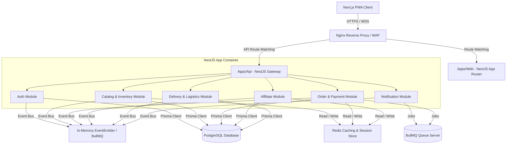
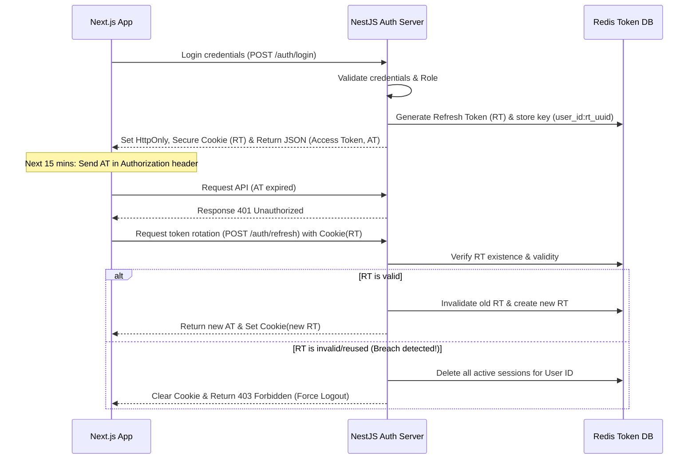
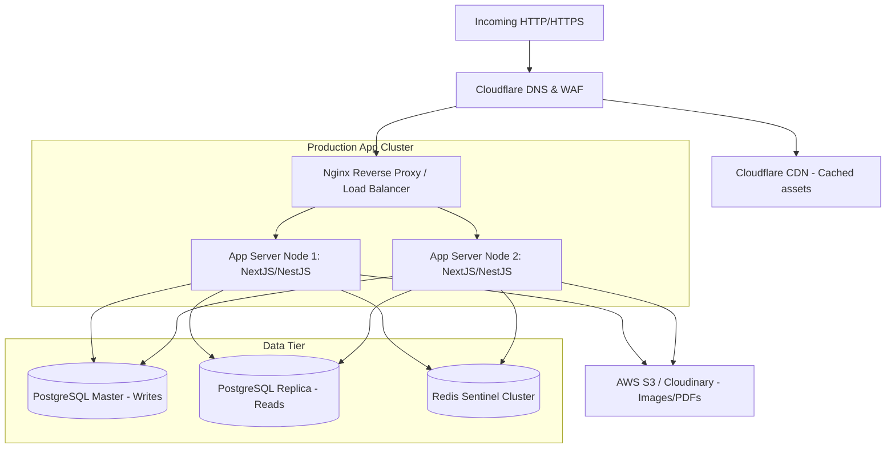

# System Architecture & Design Blueprint

## Project Name: Mangosteen

### Document Version: 1.0.0 (Production-Ready Draft)

### System Type: High-Throughput Modular Monolith (CQRS-ready)

---

## 1. Document Control & Agent Collaboration Log

This technical architectural blueprint was developed and audited under a **Two-Agent Peer Review Workflow**:

| Role               | Agent Persona                                       | Contribution                                                                                                                                                 |
| :----------------- | :-------------------------------------------------- | :----------------------------------------------------------------------------------------------------------------------------------------------------------- |
| **Drafting Agent** | **Agent 1: Lead Enterprise Architect**              | Authored modular monorepo service interfaces, Clean Architecture layers, BullMQ workflow definitions, and WebSocket integration strategies.                  |
| **Reviewer Agent** | **Agent 2: Principal Systems & Security Architect** | Audited security layers, designed access/refresh token rotation sequence, verified Redis cluster caching mechanisms, and specified reverse-proxy topologies. |

### Peer Review & Hardening Log:

- **Audit Ref #4 (Double-Token Security)**: Replaced standard stateless JWT with a hybrid Token-Pair Rotation scheme (Access JWT short-lived; encrypted Refresh Token stored in Redis blacklist and verified in HTTP-only, secure, SameSite cookies).
- **Audit Ref #5 (Concurrency & Event-Locking)**: Added an explicit Redis-based distributed locking scheme (`Redlock`) to manage critical inventory decrement and campaign flash sale checkouts, preventing race conditions.
- **Audit Ref #6 (Reverse Proxy & rate-limiting configuration)**: Specified Nginx rate-limiting parameters and proxy headers to filter out malicious traffic before hitting the NestJS application layer.

---

## 2. High-Level System Architecture

Mangosteen follows a **Modular Monolith** pattern organized in a monorepo structure. The codebase represents distinct domain modules (e.g., Auth, Catalog, Order, Affiliate, Logistics) with highly isolated database access and event-driven communication. This ensures the modules are highly decoupled and can be easily migrated to **Microservices** in the future.



---

## 3. Clean Architecture: Modular Monolith Design

To prevent the application from turning into a spaghetti "big ball of mud", each module is organized into structured architectural layers, adhering to Clean Architecture principles:

1. **API Layer (Controllers & WebSockets)**: Exposes endpoints, validates incoming Request DTOs using class-validator/Zod, parses routing parameters, and handles HTTP response envelopes.
2. **Domain/Application Layer (Services & Commands)**: Encapsulates business logic, calculates pricing/commissions, coordinates state machines, and enforces system limits. Completely decoupled from HTTP frameworks.
3. **Data Access Layer (Repositories & Prisma Client)**: Manages database interaction, queries PostgreSQL, updates Redis keys, and implements soft-deletes and transactions.
4. **Events Layer**: Publishes internal events (e.g., `OrderPlacedEvent`) and handles incoming asynchronous messages.

### Service Boundaries & Interfaces (CQRS-ready)

To enable future migration to a Command Query Responsibility Segregation (CQRS) model, write-heavy operations (e.g., `CreateOrderCommand`) are decoupled from read-heavy requests (e.g., `GetCatalogQuery`).

---

## 4. Communication & Streaming Protocols

### 4.1. Event-Driven Workflow (Asynchronous Job Queues)

Heavyweight, non-blocking computations are dispatched as background jobs to **BullMQ** backed by **Redis**:

- **Notification Dispatching**: SMS reminders, email templates, and push notifications are queued and retried with exponential backoff.
- **Affiliate Commission Settlement**: When an order transitions to `DELIVERED`, a job checks the COD status and updates the affiliate's wallet balance inside a safe database transaction.
- **Session Cleaning & Click Analytics**: High-frequency click aggregation from affiliate referrals are cached in Redis, then batched and pushed to PostgreSQL every 5 minutes to reduce direct write operations.

### 4.2. WebSocket Architecture (Real-Time State Sync)

WebSockets (using `@nestjs/websockets` with `Socket.io`) are utilized to maintain live connections with actively viewing customers and delivery agents.

- **Inventory Broadcasts**: Real-time stock drops or flash-sale volume decreases are instantly pushed to viewing customer browsers:
  - Room: `product:id`
  - Event: `stock:update` -> `{ availableStock: X }`
- **Real-time Order Tracking**: Customers receive instant UI updates (e.g., "Your mango order has been packed!") as the delivery agent progresses:
  - Room: `order:id`
  - Event: `status:change` -> `{ status: "SHIPPED", agentLocation: { lat, lng } }`

---

## 5. Security & Authentication Architecture

Security and data integrity are central to the platform's design, employing a defense-in-depth architecture.

### 5.1. Secure JWT Pair Rotation Workflow

Instead of storing stateless JWTs in insecure client-side `localStorage`, the platform implements a hybrid **Access Token & Refresh Token Rotation (RTR)** flow:



### 5.2. Role-Based Access Control (RBAC) Guard Configuration

We enforce dynamic routes using a custom NestJS `@Roles` decorator, backed by a global `RolesGuard` matching user scopes against target endpoints:

```typescript
@Roles(UserRole.ADMIN, UserRole.SUPER_ADMIN)
@UseGuards(JwtAuthGuard, RolesGuard)
@Controller('admin/campaigns')
export class AdminCampaignController { ... }
```

### 5.3. Rate Limiting & API Shielding

- **DDoS & Scraping Defense**: Global rate limiting via `nestjs-throttler` with a Redis storage backend.
- **OTP Limit Policy**: Login/Verification OTP triggers are limited to 3 attempts per 5 minutes per phone number to avoid API abuse costs.

---

## 6. Database Caching & Consistency Strategy

### 6.1. Redis Caching Architecture

To guarantee ultra-low latency (<20ms response time), dynamic product listing data and active seasonal campaigns are cached.

- **Cache-Aside Pattern**: Reading requests look up the cache first; if a cache-miss occurs, data is fetched from PostgreSQL, written to Redis, and returned.
- **Cache Invalidation Policy**: Whenever a product, variant price, or banner is updated via the Admin panel, a hook triggers an invalidation:
  - `cache:del("catalog:active")`
  - `cache:del("product:slug:" + product.slug)`
- **TTL Policy**: Generic catalog cache uses a strict Time-To-Live (TTL) of 3600 seconds (1 hour) as a fallback.

### 6.2. Concurrency Control (Distributed Locks)

In high-traffic seasonal sales (e.g., first harvest of Himsagar mangoes), multiple customers try to purchase limited stock variants simultaneously. To prevent double-booking (overselling):

- We execute stock deduction inside a PostgreSQL transaction with an explicit **Pessimistic Write Lock** (`SELECT ... FOR UPDATE` via Prisma).
- For campaign limits and cart-checkouts, a **Redis-based Redlock** is acquired. If the lock is held, requests wait or abort immediately, preserving database consistency.

---

## 7. DevOps & Deployment Topology

The infrastructure utilizes a robust, automated layout ensuring high-availability and zero downtime updates.



### Production Infrastructure Stack:

1. **Routing & Load Balancing**: Nginx acts as a reverse proxy, parsing incoming SSL certificates via Let's Encrypt, compressing assets with Gzip, and proxying backend routes `/api/*` to NestJS and frontend routes `/*` to Next.js.
2. **Containerization**: Entire application packaged into Docker containers, orchestrated using Docker Compose or Kubernetes (EKS/GKE) in production.
3. **Database Architecture**: PostgreSQL configured with primary-replica replication. Multi-region routing via Prisma read-replicas ensures read queries hit local zones.
4. **CI/CD Pipeline**: GitHub Actions automates unit tests, Docker builds, pushes image tags to Amazon ECR, and deploys updates using rolling deployments to avoid service disruption.
