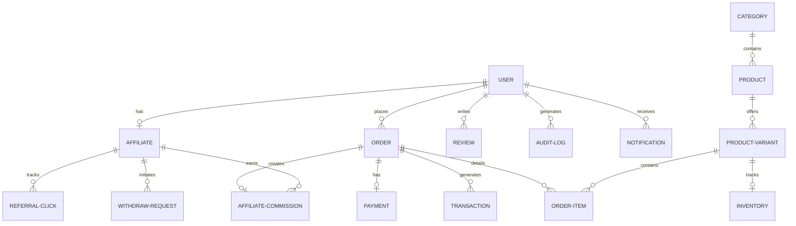

# Database Engine & Schema Reference Manual

## Project Name: Mangosteen

### Document Version: 1.0.0 (Production-Ready Draft)

### Storage Engine: PostgreSQL + Redis Cache

---

## 1. Document Control & Agent Collaboration Log

This storage and database architecture blueprint was developed and audited under a **Two-Agent Peer Review Workflow**:

| Role               | Agent Persona                                 | Contribution                                                                                                                                              |
| :----------------- | :-------------------------------------------- | :-------------------------------------------------------------------------------------------------------------------------------------------------------- |
| **Drafting Agent** | **Agent 1: Lead Enterprise Architect**        | Mapped Prisma models to PostgreSQL schemas, documented relationships, defined primary and foreign keys, and formulated initial indexing policies.         |
| **Reviewer Agent** | **Agent 2: Principal DBA & Systems Engineer** | Hardened query paths, established PostgreSQL connection-pooling strategies, designed soft-delete triggers, and formulated transaction-isolation patterns. |

### Peer Review & Hardening Log:

- **Audit Ref #10 (Transaction Consistency)**: Identified potential race conditions in bulk inventory deductions. Enforced pessimistic locks (`SELECT FOR UPDATE`) on critical transactional boundaries.
- **Audit Ref #11 (Soft-Delete Filtering)**: Set up global Prisma client query extensions to automatically filter out rows where `deletedAt != null`, avoiding accidental leakage of deleted customer data.
- **Audit Ref #12 (Critical Foreign Key Indexes)**: Added database-level multi-column composite indexes on high-frequency query paths (e.g., `ReferralClick` clickedAt, `Order` status, `AffiliateCommission` status) to maintain low query latencies.

---

## 2. Relational Architecture & Entity Description

The database is built on PostgreSQL, using Prisma ORM as the translation layer. The schema is highly modularized, keeping clean data boundaries between different business functions.



### 2.1. User & Access Control Core

- **`User`**: The central actor entity. Stores name, email, password hashes, mobile numbers, active status, role indicators (Customer, Affiliate, Admin, etc.), and soft-delete field.
- **`AuditLog`**: A read-only, append-only log capturing administrative actions (e.g., balance updates, product deletions, status overrides) for compliance and tracking.

### 2.2. Product & Inventory Engine

- **`Category`**: Broad taxonomies of mango varieties (e.g., "Seasonal Favorites", "Gourmet Selections").
- **`Product`**: Base product definition (sweetness, organic indicator, origin district, SEO tags, list of image URLs).
- **`ProductVariant`**: Sellable boxes or weight selections containing price, specific weight in kilograms, SKU, and active discount parameters.
- **`Inventory`**: Real-time batch-level tracking mapping to `ProductVariant`. Holds harvest dates, batch identifiers, available stock, and reserved checkouts.

### 2.3. Affiliate & Commission Engine

- **`Affiliate`**: Holds wallet balances, active flags, bank payout routing info, and unique referral codes mapped to a `User` record.
- **`ReferralClick`**: High-frequency click tracker saving IP, user-agent, referrers, and timestamps.
- **`AffiliateCommission`**: Binds an `Order` to a specific `Affiliate` record, tracking the commission amount and status (Pending, Approved, Cancelled).
- **`WithdrawRequest`**: Payout ledger documenting balance withdrawals, status transitions (Pending → Paid), transaction references, and methods.

### 2.4. Orders & Transactional Core

- **`Order`**: Tracks lifecycle states, addresses, shipping zone charges, delivery slots, assigned agent IDs, dynamic delivery OTPs, and Cash on Delivery (COD) verification flags.
- **`OrderItem`**: Frozen price snapshot of product variants purchased within an order.
- **`Payment`**: Captures stripe tokens, SSLCommerz transactions, payment methods, and current statuses (Paid, Pending, Refunded).
- **`Transaction`**: Raw credit/debit double-entry transaction record.
- **`Coupon`**: Promotion rules dictating percentage/absolute value discounts, limits, active flags, and expiry dates.

---

## 3. Database Performance & Indexing Strategy

To guarantee rapid query execution even with hundreds of thousands of concurrent clicks, orders, and products, the database incorporates a deliberate indexing strategy on foreign keys and highly filtered fields.

| Table               | Index Target Columns                        | Index Type       | Reason                                                                        |
| :------------------ | :------------------------------------------ | :--------------- | :---------------------------------------------------------------------------- |
| **`User`**          | `(email)`, `(role)`                         | B-Tree           | High-frequency lookup during session authentication and permission guards.    |
| **`Product`**       | `(categoryId)`, `(slug)`                    | B-Tree           | Dynamic menu navigation and dynamic page lookup.                              |
| **`ReferralClick`** | `(affiliateId)`, `(clickedAt)`              | Composite B-Tree | Time-series query optimization for affiliate dashboard charts.                |
| **`Order`**         | `(userId)`, `(status)`, `(deliveryAgentId)` | B-Tree           | Speeds up customer profile listings and delivery agent logistics assignments. |
| **`Payment`**       | `(orderId)`, `(gatewayTxId)`                | B-Tree           | Quick webhook reconciliation and duplicate transaction prevention.            |

---

## 4. Operational Database Patterns

### 4.1. Soft-Delete Pattern (Data Retention Compliance)

To maintain referential integrity without losing transactional logs, physical `DELETE` statements are prohibited on core catalog, user, and order tables.

- The `User`, `Category`, `Product`, `ProductVariant`, and `Coupon` tables contain a nullable `deletedAt` field.
- A custom **Prisma Client Middleware / Extension** intercepts query commands:
  ```typescript
  prisma.$extends({
    query: {
      $allModels: {
        async findMany({ model, args, query }) {
          if ("deletedAt" in prisma[model].fields) {
            args.where = { ...args.where, deletedAt: null };
          }
          return query(args);
        },
      },
    },
  });
  ```

### 4.2. Safe Concurrency (Pessimistic vs Optimistic Locking)

To prevent overselling a limited seasonal mango harvest:

- **Catalog Updates**: Safe updates to name/descriptions use standard **Optimistic Locking** (Prisma checks query states).
- **Inventory Decrement**: Inventory deduction during busy checkouts runs inside a PostgreSQL transaction using an explicit **Pessimistic Write Lock** (`SELECT ... FOR UPDATE`):
  ```typescript
  await prisma.$transaction(async (tx) => {
    const stock = await tx.$queryRaw`
      SELECT * FROM "Inventory" 
      WHERE "variantId" = ${variantId} 
      FOR UPDATE
    `;
    if (stock[0].availableStock < quantity) {
      throw new Error("Insufficient inventory");
    }
    await tx.inventory.update({
      where: { variantId },
      data: { availableStock: { decrement: quantity } },
    });
  });
  ```
