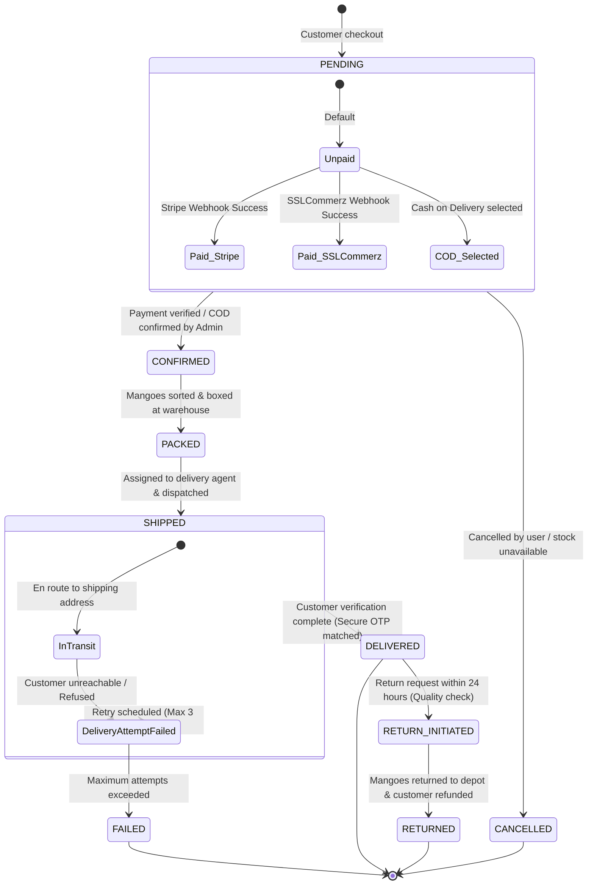
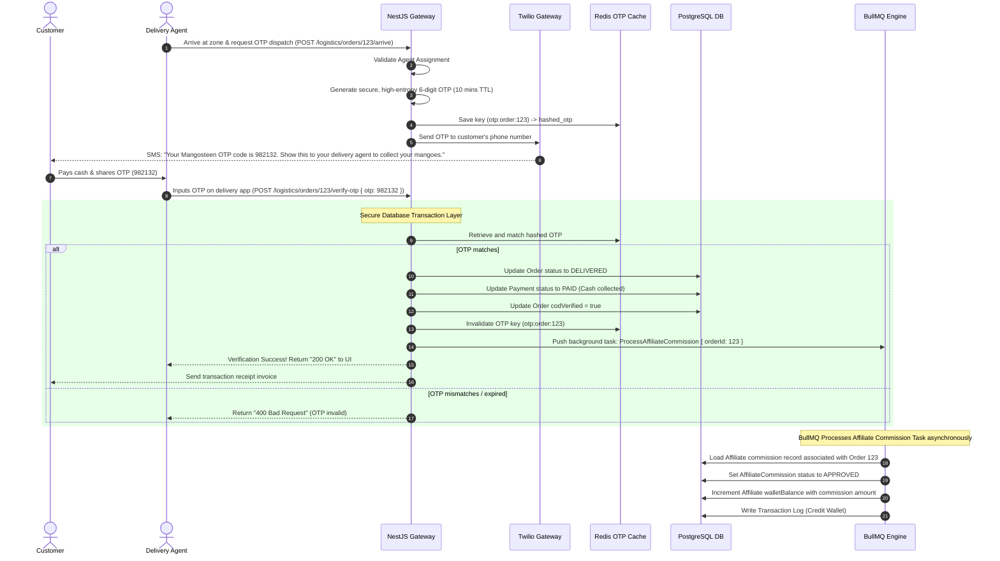

# Core Workflows & State Machine Manual

## Project Name: Mangosteen

### Document Version: 1.0.0 (Production-Ready Draft)

### Systems Covered: Affiliate Attribution, Payment Reconciliation, Secure COD Verification

---

## 1. Document Control & Agent Collaboration Log

This workflow engineering blueprint was developed and audited under a **Two-Agent Peer Review Workflow**:

| Role               | Agent Persona                                       | Contribution                                                                                                                               |
| :----------------- | :-------------------------------------------------- | :----------------------------------------------------------------------------------------------------------------------------------------- |
| **Drafting Agent** | **Agent 1: Lead Enterprise Architect**              | Formulated the order processing pipeline, constructed base checkout workflows, and designed default state machines.                        |
| **Reviewer Agent** | **Agent 2: Principal Systems & Security Architect** | Hardened and designed the secure COD OTP protocol, established anti-fraud click attribution filters, and resolved webhook race conditions. |

### Peer Review & Hardening Log:

- **Audit Ref #13 (Anti-Fraud Click Attribution)**: Rejected simple URL-parameter-to-cookie storage. Designed a multi-parameter fingerprint check (IP + User-Agent header hashing) paired with a 15-second minimum click-to-conversion window to prevent bots from hijacking payouts.
- **Audit Ref #14 (Webhooks & Concurrency Locks)**: Added an explicit idempotent transaction lock to payment webhook receivers, preventing double-credit operations when payment processors fire duplicate HTTP calls.
- **Audit Ref #15 (Secure COD OTP Protocol)**: Designed an automated high-entropy OTP flow triggered via SMS. When the delivery agent arrives, they must input the customer's OTP to trigger a secure database transaction that updates order states and schedules affiliate wallet balance releases in real-time.

---

## 2. Affiliate Referral & Click Attribution Workflow

This workflow ensures accurate, tamper-proof tracking of affiliate clicks and successful commission releases, blocking fraud attempts like cookie stuffing and automatic click generation.

```mermaid
sequenceDiagram
    autonumber
    participant Customer as Customer Browser
    participant Nginx as Nginx Proxy
    participant Redis as Redis Click Cache
    participant API as NestJS Gateway
    participant DB as PostgreSQL DB

    Customer->>Nginx: Clicks affiliate referral link (/products/amrapali-box?ref=aff_9821)
    Nginx->>API: Route to Product Controller

    rect rgb(220, 240, 255)
        Note over API: Click Filtering & Anti-Fraud Engine
        API->>API: Generate Hashed Browser Fingerprint (IP + User-Agent)
        API->>Redis: Check velocity key (click:fingerprint:ref_id)
        alt Velocity limits exceeded (click < 15s ago from same fingerprint)
            API->>API: Silently drop tracking (proceed as organic click)
        else Velocity limits OK
            API->>Redis: Set velocity lockout key (15s TTL)
            API->>Redis: Queue click record to batch process queue
            API->>Customer: Set HTTP-Only tracking cookie (ref_id=aff_9821; Max-Age=30 days; Secure)
        end
    end

    API-->>Customer: Render product details page

    Note over Customer: Customer decides to buy 5kg box & checks out (COD)
    Customer->>API: Submit Order (POST /orders/checkout with ref_id cookie)
    API->>DB: Write Order with status: PENDING & affiliateCommission: PENDING
    API-->>Customer: Order Confirmed
```

---

## 3. Order & Payment Reconciliation State Machine

Orders progress through a strict, multi-step state machine with validation locks at each stage to ensure consistency.



### Payment Webhook Reconciliation:

To avoid race conditions and double-credit operations:

1. Backend checks `Payment` table for `gatewayTxId` using a unique constraint. If already marked `PAID`, the webhook returns an instant `200 OK` to Stripe/SSLCommerz to prevent duplicate processing.
2. If state is `PENDING`, a transaction block updates the `Payment` to `PAID`, updates `Order` to `CONFIRMED`, decrements inventory, and registers the transaction log.

---

## 4. Secure COD Verification OTP Workflow

Cash on Delivery orders represent high operational risks (e.g., delivery agents collecting cash but marking orders as "failed/returned", or pocketing commissions for fake customers). The platform resolves this with a **Secure Delivery OTP Verification Flow**:


